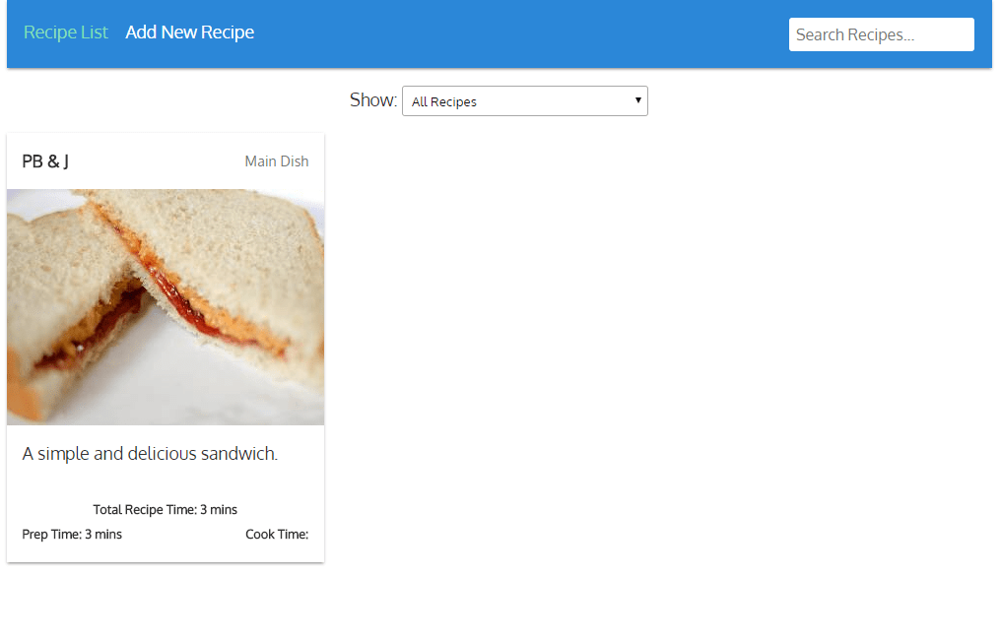
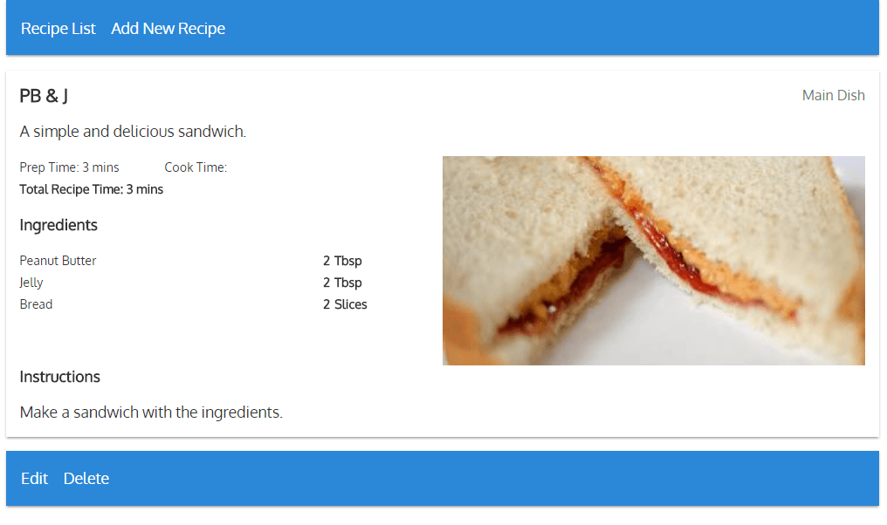
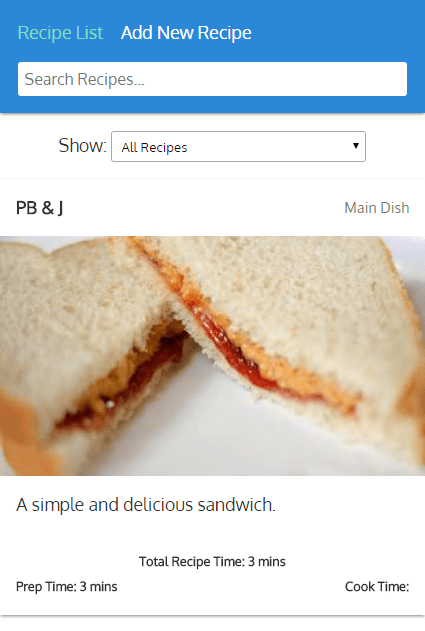

# recipes

A Vue.js SPA to keep track of recipes

Here's an example of the searchable, filterable, recipes list page (the default route):



And this is what it looks like when you open a recipe:



And of course, it's responsive so it looks nice on any screen:



## Build Setup

``` bash
# install dependencies
npm install

# serve with hot reload at localhost:8080 and api at localhost:3000
npm start

# build for production with minification
npm run build

# build for production and view the bundle analyzer report
npm run build --report

# run unit tests
npm run unit

# run e2e tests
npm run e2e

# run all tests
npm test
```
